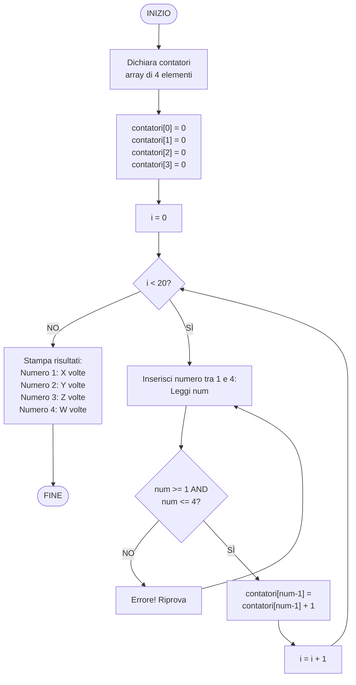
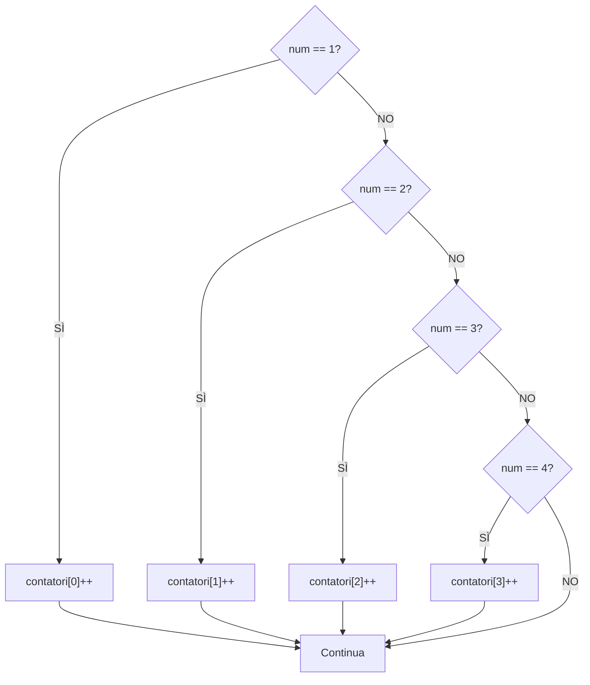

# Esercizio 10: Diagramma di flusso - Contare occorrenze numeri 1-4

## Traccia
Si disegni il diagramma di flusso dell'algoritmo che, dopo aver chiesto per 20 volte all'utente di inserire un numero intero compreso tra 0 e 5 (esclusi gli estremi), riporti quante volte ciascun numero è stato inserito.

## Spiegazione

L'algoritmo deve:
1. Chiedere all'utente di inserire un numero 20 volte
2. Ogni numero deve essere compreso tra 0 e 5 **esclusi gli estremi**, quindi i numeri validi sono: **1, 2, 3, 4**
3. Contare quante volte ciascun numero (1, 2, 3, 4) è stato inserito
4. Stampare il conteggio per ciascun numero

**Nota**: "Esclusi gli estremi" significa che 0 e 5 non sono validi. I numeri validi sono solo 1, 2, 3, 4.

## Algoritmo

1. **INIZIO**
2. Dichiara array contatori: `contatori[4]` (per numeri 1, 2, 3, 4)
3. Inizializza tutti i contatori a 0
4. Inizializza `i = 0`
5. **Ciclo**: Per `i` da 0 a 19 (20 iterazioni):
   - Chiedi all'utente di inserire un numero tra 1 e 4
   - Leggi il numero `num`
   - Se `num` è valido (1, 2, 3, o 4):
     - Incrementa `contatori[num - 1]` (perché array parte da 0)
   - Altrimenti:
     - Mostra errore e richiedi di nuovo
   - Incrementa `i`
6. Stampa i contatori per ciascun numero
7. **FINE**

## Diagramma di flusso



## Descrizione dettagliata dei passaggi

1. **Inizializzazione contatori**:
   - Crea un array `contatori[4]` per memorizzare le occorrenze
   - `contatori[0]` per il numero 1
   - `contatori[1]` per il numero 2
   - `contatori[2]` per il numero 3
   - `contatori[3]` per il numero 4
   - Inizializza tutti a 0

2. **Ciclo principale** (20 iterazioni):
   - Per ogni iterazione:
     - Chiede all'utente di inserire un numero
     - Legge il numero `num`
     - Valida che `num` sia tra 1 e 4 (inclusi)
     - Se valido:
       - Incrementa `contatori[num - 1]` (perché array parte da 0)
       - Esempio: se `num = 3`, incrementa `contatori[2]`
     - Se non valido:
       - Mostra errore e richiede di nuovo (senza incrementare `i`)

3. **Output**:
   - Stampa il conteggio per ciascun numero:
     - "Numero 1 inserito X volte"
     - "Numero 2 inserito Y volte"
     - "Numero 3 inserito Z volte"
     - "Numero 4 inserito W volte"

## Esempio di esecuzione

**Input (20 numeri):**
```
Inserisci numero tra 1 e 4: 1
Inserisci numero tra 1 e 4: 2
Inserisci numero tra 1 e 4: 3
Inserisci numero tra 1 e 4: 4
Inserisci numero tra 1 e 4: 1
Inserisci numero tra 1 e 4: 2
Inserisci numero tra 1 e 4: 3
Inserisci numero tra 1 e 4: 1
Inserisci numero tra 1 e 4: 2
Inserisci numero tra 1 e 4: 4
Inserisci numero tra 1 e 4: 1
Inserisci numero tra 1 e 4: 3
Inserisci numero tra 1 e 4: 2
Inserisci numero tra 1 e 4: 4
Inserisci numero tra 1 e 4: 1
Inserisci numero tra 1 e 4: 2
Inserisci numero tra 1 e 4: 3
Inserisci numero tra 1 e 4: 4
Inserisci numero tra 1 e 4: 1
Inserisci numero tra 1 e 4: 2
```

**Conteggio:**
- Numero 1: 6 volte
- Numero 2: 6 volte
- Numero 3: 4 volte
- Numero 4: 4 volte

**Output:**
```
Risultati:
Numero 1 è stato inserito 6 volte
Numero 2 è stato inserito 6 volte
Numero 3 è stato inserito 4 volte
Numero 4 è stato inserito 4 volte
```

## Variante con switch-case

Per gestire l'incremento del contatore:



## Note

- **Numeri validi**: Solo 1, 2, 3, 4 (0 e 5 sono esclusi)
- **Indicizzazione**: `contatori[num - 1]` perché gli array partono da 0
- **Validazione**: Importante controllare che il numero sia tra 1 e 4
- **Conteggio**: Ogni numero può apparire da 0 a 20 volte (ma la somma deve essere 20)
- **Efficienza**: Usare un array di contatori è più efficiente di usare variabili separate