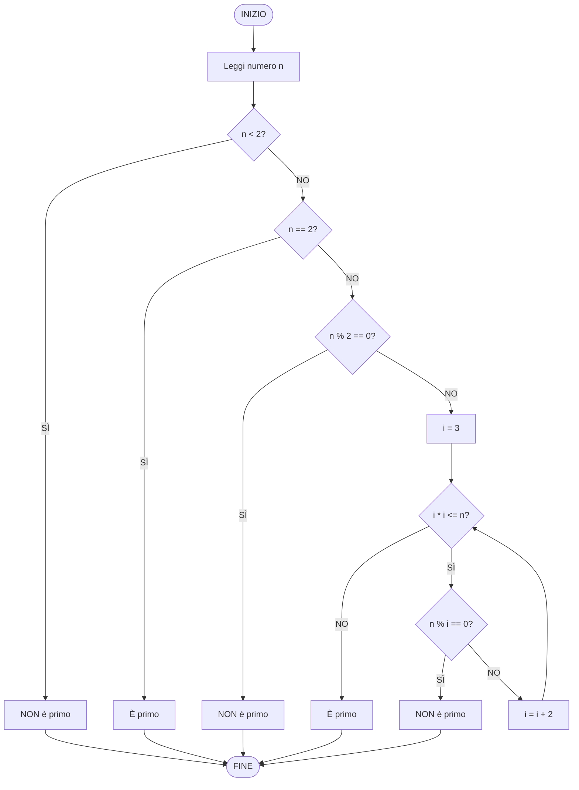

# Esercizio 2: Diagramma di flusso - Verifica numero primo

## Traccia
Si disegni un diagramma di flusso dell'algoritmo che, dopo aver acquisito un numero intero come input, stabilisca se è primo oppure no.

## Spiegazione

Un diagramma di flusso rappresenta graficamente l'algoritmo per verificare se un numero è primo. Un numero primo è divisibile solo per 1 e per se stesso.

## Algoritmo

1. **INIZIO**
2. Acquisisci il numero intero `n`
3. Se `n < 2` → NON è primo → VAI A FINE
4. Se `n == 2` → È primo → VAI A FINE
5. Se `n % 2 == 0` (n è pari) → NON è primo → VAI A FINE
6. Inizializza `i = 3`
7. **Ciclo**: Mentre `i <= sqrt(n)`:
   - Se `n % i == 0` → NON è primo → VAI A FINE
   - Incrementa `i` di 2 (salta i numeri pari)
8. Se il ciclo termina senza trovare divisori → È primo
9. **FINE**

## Diagramma di flusso

## Descrizione dettagliata dei passaggi

1. **Acquisizione input**: Legge il numero `n` dall'utente

2. **Controlli iniziali**:
   - Se `n < 2`: non è primo (i numeri primi sono ≥ 2)
   - Se `n == 2`: è primo (unico numero primo pari)
   - Se `n` è pari e > 2: non è primo

3. **Controllo divisori** (solo per numeri dispari > 2):
   - Inizia da `i = 3` (primo numero dispari > 1)
   - Controlla se `n` è divisibile per `i`
   - Se sì, `n` non è primo
   - Incrementa `i` di 2 (salta i numeri pari)
   - Continua fino a `sqrt(n)` (ottimizzazione)

4. **Risultato**: Se nessun divisore viene trovato, il numero è primo

## Esempio di esecuzione

**Input: n = 17**
- n ≥ 2 ✓
- n ≠ 2 ✓
- n è dispari ✓
- Controlla divisori: 3, 5, 7 (√17 ≈ 4.12)
- 17 % 3 ≠ 0, 17 % 5 ≠ 0, 17 % 7 ≠ 0
- **Risultato: È primo**

**Input: n = 15**
- n ≥ 2 ✓
- n ≠ 2 ✓
- n è dispari ✓
- Controlla divisori: 3 (√15 ≈ 3.87)
- 15 % 3 = 0 → trovato divisore
- **Risultato: NON è primo**

## Note

- L'ottimizzazione con `sqrt(n)` riduce il numero di controlli
- Si controllano solo numeri dispari (i pari sono già esclusi)
- Il diagramma mostra tutti i casi possibili in modo chiaro