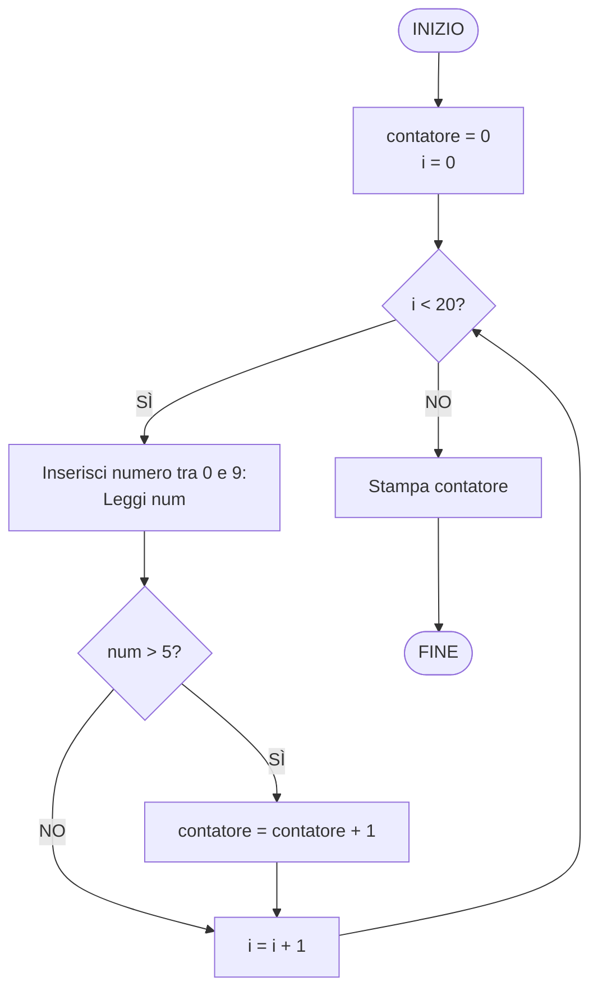
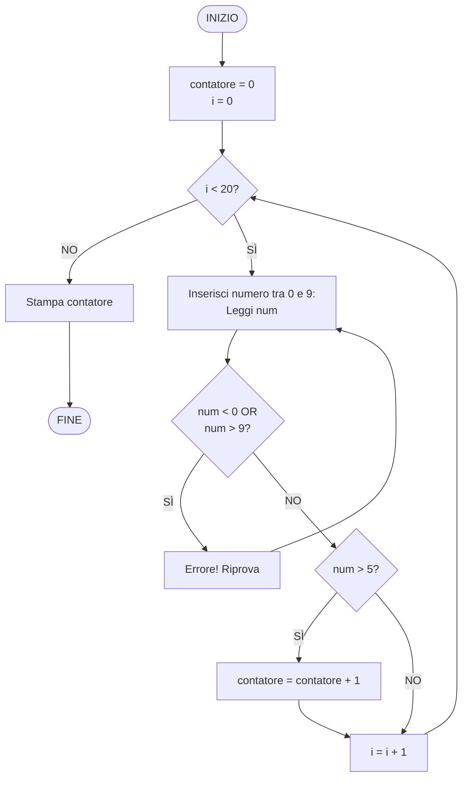

# Esercizio 6: Diagramma di flusso - Contare numeri maggiori di 5

## Traccia
Si disegni il diagramma di flusso dell'algoritmo che, dopo aver chiesto per 20 volte all'utente di inserire un numero intero compreso tra 0 e 9, riporti quante volte è stato inserito un numero maggiore di 5.

## Spiegazione

L'algoritmo deve:
1. Chiedere all'utente di inserire un numero 20 volte
2. Ogni numero deve essere compreso tra 0 e 9 (inclusi)
3. Contare quanti di questi numeri sono maggiori di 5 (cioè 6, 7, 8, 9)
4. Stampare il risultato del conteggio

## Algoritmo

1. **INIZIO**
2. Inizializza `contatore = 0`
3. Inizializza `i = 0`
4. **Ciclo**: Per `i` da 0 a 19 (20 iterazioni):
   - Chiedi all'utente di inserire un numero tra 0 e 9
   - Leggi il numero `num`
   - Se `num > 5`:
     - Incrementa `contatore` di 1
   - Incrementa `i` di 1
5. Stampa `contatore`
6. **FINE**

## Diagramma di flusso



## Descrizione dettagliata dei passaggi

1. **Inizializzazione**:
   - `contatore = 0`: variabile per contare i numeri > 5
   - `i = 0`: variabile per il ciclo

2. **Ciclo principale** (20 iterazioni):
   - Per ogni iterazione da 0 a 19:
     - Chiede all'utente di inserire un numero
     - Legge il numero `num`
     - Verifica se `num > 5`
       - Se sì, incrementa `contatore`
     - Incrementa `i` per passare alla prossima iterazione

3. **Output**:
   - Stampa il valore finale di `contatore`

## Esempio di esecuzione

**Input (20 numeri):**
```
Inserisci numero tra 0 e 9: 3
Inserisci numero tra 0 e 9: 7
Inserisci numero tra 0 e 9: 2
Inserisci numero tra 0 e 9: 9
Inserisci numero tra 0 e 9: 1
Inserisci numero tra 0 e 9: 6
Inserisci numero tra 0 e 9: 4
Inserisci numero tra 0 e 9: 8
Inserisci numero tra 0 e 9: 0
Inserisci numero tra 0 e 9: 5
Inserisci numero tra 0 e 9: 7
Inserisci numero tra 0 e 9: 3
Inserisci numero tra 0 e 9: 9
Inserisci numero tra 0 e 9: 2
Inserisci numero tra 0 e 9: 6
Inserisci numero tra 0 e 9: 1
Inserisci numero tra 0 e 9: 8
Inserisci numero tra 0 e 9: 4
Inserisci numero tra 0 e 9: 7
Inserisci numero tra 0 e 9: 0
```

**Analisi:**
- Numeri > 5: 7, 9, 6, 8, 7, 9, 6, 8, 7
- Totale: 9 numeri

**Output:**
```
Sono stati inseriti 9 numeri maggiori di 5.
```

## Variante con validazione input

Se vogliamo aggiungere un controllo per assicurarci che il numero sia tra 0 e 9:



## Note

- I numeri maggiori di 5 sono: 6, 7, 8, 9
- Il numero 5 non viene contato (la condizione è `> 5`, non `>= 5`)
- Il ciclo viene eseguito esattamente 20 volte
- Non è necessario memorizzare tutti i numeri, basta contare quelli che soddisfano la condizione