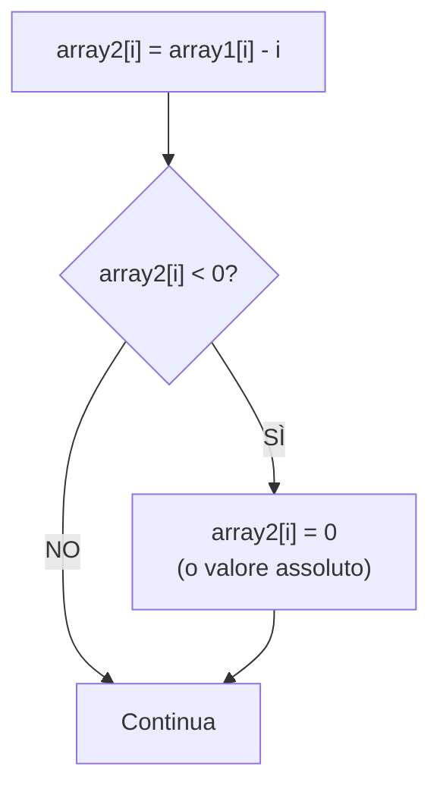

# Esercizio 8: Diagramma di flusso - Sottrazione posizione

## Traccia
Si disegni il diagramma di flusso dell'algoritmo che:
* legga in input 20 numeri interi non negativi in base 10 e li memorizzi in un array;
* memorizzi in un secondo array il numero ottenuto sottraendo a ciascun elemento la sua posizione.

## Spiegazione

L'algoritmo deve:
1. Leggere 20 numeri interi non negativi
2. Memorizzarli in un primo array
3. Creare un secondo array dove ogni elemento è ottenuto sottraendo la posizione (indice) dal valore corrispondente del primo array
4. La posizione parte da 0 (primo elemento in posizione 0, secondo in posizione 1, ecc.)

**Formula**: `array2[i] = array1[i] - i`

Dove `i` è la posizione (indice) dell'elemento nell'array.

## Algoritmo

1. **INIZIO**
2. Dichiara `array1[20]`, `array2[20]`
3. Inizializza `i = 0`
4. **Ciclo 1**: Per `i` da 0 a 19:
   - Leggi numero e salva in `array1[i]`
   - Incrementa `i`
5. Inizializza `i = 0`
6. **Ciclo 2**: Per `i` da 0 a 19:
   - `array2[i] = array1[i] - i`
   - Incrementa `i`
7. Stampa `array2` (opzionale)
8. **FINE**

## Diagramma di flusso

```mermaid
flowchart TD
    START([INIZIO]) --> DECLARE["Dichiara array1, array2<br/>di 20 elementi ciascuno"]
    DECLARE --> INIT1["i = 0"]
    INIT1 --> LOOP1{"i < 20?"}
    LOOP1 -->|NO| INIT2["i = 0"]
    LOOP1 -->|SÌ| READ["Inserisci numero non negativo:"<br/>Leggi numero<br/>array1[i] = numero]
    READ --> INCR1["i = i + 1"]
    INCR1 --> LOOP1
    INIT2 --> LOOP2{"i < 20?"}
    LOOP2 -->|NO| PRINT["Stampa array2<br/>opzionale"]
    LOOP2 -->|SÌ| CALC["array2[i] = array1[i] - i"]
    CALC --> INCR2["i = i + 1"]
    INCR2 --> LOOP2
    PRINT --> END([FINE])
```

## Descrizione dettagliata dei passaggi

1. **Inizializzazione**:
   - Dichiara due array di 20 elementi ciascuno
   - `array1`: per memorizzare i numeri in input
   - `array2`: per memorizzare i risultati

2. **Lettura input** (primo ciclo):
   - Ciclo da `i = 0` a `i = 19` (20 iterazioni)
   - Per ogni iterazione:
     - Chiede all'utente di inserire un numero non negativo
     - Legge il numero e lo salva in `array1[i]`
     - Incrementa `i`

3. **Calcolo sottrazione posizione** (secondo ciclo):
   - Ciclo da `i = 0` a `i = 19`
   - Per ogni posizione `i`:
     - Calcola `array2[i] = array1[i] - i`
     - La posizione `i` viene sottratta dal valore in `array1[i]`
     - Incrementa `i`

4. **Output** (opzionale):
   - Stampa gli elementi di `array2`

## Esempio di esecuzione

**Input (array1):**
```
Posizione 0: 10
Posizione 1: 15
Posizione 2: 20
Posizione 3: 25
Posizione 4: 30
Posizione 5: 35
Posizione 6: 40
Posizione 7: 45
Posizione 8: 50
Posizione 9: 55
Posizione 10: 60
Posizione 11: 65
Posizione 12: 70
Posizione 13: 75
Posizione 14: 80
Posizione 15: 85
Posizione 16: 90
Posizione 17: 95
Posizione 18: 100
Posizione 19: 105
```

**Calcolo array2:**
- `array2[0] = array1[0] - 0 = 10 - 0 = 10`
- `array2[1] = array1[1] - 1 = 15 - 1 = 14`
- `array2[2] = array1[2] - 2 = 20 - 2 = 18`
- `array2[3] = array1[3] - 3 = 25 - 3 = 22`
- `array2[4] = array1[4] - 4 = 30 - 4 = 26`
- `array2[5] = array1[5] - 5 = 35 - 5 = 30`
- ... e così via

**Output (array2):**
```
[10, 14, 18, 22, 26, 30, 34, 38, 42, 46, 50, 54, 58, 62, 66, 70, 74, 78, 82, 86]
```

## Esempio con numeri più piccoli

**Input (array1):**
```
[5, 3, 8, 2, 10, 1, 7, 4, 9, 6, 12, 15, 3, 8, 11, 2, 6, 9, 13, 5]
```

**Calcolo:**
- `array2[0] = 5 - 0 = 5`
- `array2[1] = 3 - 1 = 2`
- `array2[2] = 8 - 2 = 6`
- `array2[3] = 2 - 3 = -1` (può essere negativo!)
- `array2[4] = 10 - 4 = 6`
- ... e così via

**Nota**: Se `array1[i] < i`, il risultato sarà negativo. Questo è accettabile se non ci sono vincoli sul segno del risultato.

## Variante con controllo valori negativi

Se vogliamo evitare valori negativi in `array2`:



## Note

- **Indici array**: In C gli array partono da 0, quindi la prima posizione è 0
- **Valori negativi**: Se `array1[i] < i`, `array2[i]` sarà negativo (a meno di controlli aggiuntivi)
- **Efficienza**: I due cicli possono essere combinati in uno solo se non serve mantenere `array1`
- **Ordine operazioni**: Prima si leggono tutti i valori, poi si calcolano le differenze